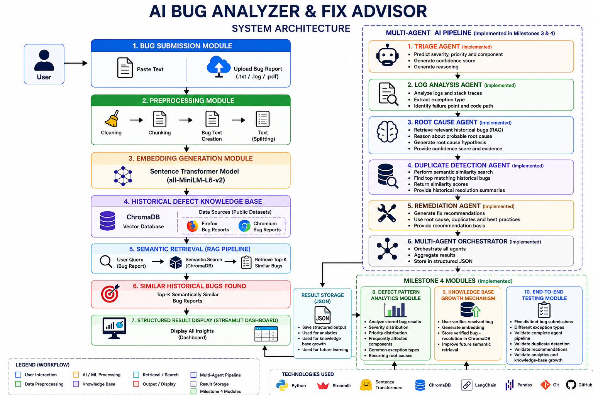

# 🐞 AI Bug Analyzer & Fix Advisor

## 📌 Project Overview

AI Bug Analyzer & Fix Advisor is an AI-powered application that assists developers in analyzing software bug reports using **Retrieval-Augmented Generation (RAG)**. The system accepts bug reports through direct text input or file uploads, preprocesses them, and retrieves semantically similar historical bug reports from a vector database to help identify duplicate issues and understand recurring software defects.

This project is being developed as part of the **Infosys Springboard Internship**.

---

## ✨ Features

- 📝 Paste bug reports directly
- 📂 Upload bug reports, log files, or PDFs
- 🧹 Data preprocessing and chunking
- 🧠 Sentence Transformer embedding generation
- 🗂️ Historical Defect Knowledge Base
- 🔍 Semantic similarity search using RAG
- 💾 ChromaDB vector database
- 🌐 Interactive Streamlit web interface

---

## 🏗️ System Architecture



---

## 🛠️ Tech Stack

| Category | Technologies |
|----------|--------------|
| Programming Language | Python |
| Frontend | Streamlit |
| Data Processing | Pandas |
| Text Chunking | LangChain RecursiveCharacterTextSplitter |
| Embedding Model | Sentence Transformers (all-MiniLM-L6-v2) |
| Vector Database | ChromaDB |
| Retrieval | Retrieval-Augmented Generation (RAG) |
| Version Control | Git & GitHub |

---

## 📂 Datasets

The Historical Defect Knowledge Base is built using public software bug datasets.

- Chromium Bug Reports (Kaggle)
- Firefox Bug Reports (Kaggle)

> **Note:** Large datasets are not included in this repository because they exceed GitHub's file size limits. Download them separately and place them inside the `data/` directory.

---

## 📁 Project Structure

```text
AI_Bug_Analyzer/
│
├── data/
│   ├── archive/
│   └── firefox/
│
├── docs/
│   ├── Architecture.png
│   ├── Design_Document.md
│   └── Tech_Stack.md
│
├── rag/
│   ├── __init__.py
│   ├── embedding.py
│   ├── retrieval.py
│   └── vector_store.py
│
├── uploads/
│
├── main.py
├── test_dataset.py
├── requirements.txt
├── README.md
└── .gitignore
```

## 🏗️ System Architecture


---

## 📥 Clone the Repository

```bash
git clone https://github.com/amruthadiddekunta/AI_Bug_Analyzer.git
cd AI_Bug_Analyzer
```

---

## ⚙️ Installation

Create and activate a virtual environment:

### Windows

```bash
python -m venv venv
venv\Scripts\activate
```

Install the required packages:

```bash
pip install -r requirements.txt
```

---

## ▶️ Run the Application

Start the Streamlit application:

```bash
streamlit run main.py
```

---

## 📌 Current Progress

### ✅ Milestone 1 Completed

Implemented features:

- Bug Submission Module
- File Upload Support
- Historical Defect Knowledge Base
- Data Cleaning
- Bug Text Creation
- Text Chunking
- Embedding Generation
- ChromaDB Vector Database
- Semantic Retrieval using RAG
- Streamlit User Interface
- Design Documentation
- System Architecture
- Technical Documentation

---

## 🔮 Future Enhancements

The following modules will be implemented in upcoming milestones:

- 🤖 Triage Agent
- 📑 Log Analysis Agent
- 🔍 Root Cause Analysis Agent
- 🔄 Duplicate Detection Agent
- 💡 Remediation Suggestion Agent
- 📊 Defect Pattern Analytics Dashboard
- 🧠 LLM-based Bug Fix Recommendations

---

## 👩‍💻 Developed By

**Diddekunta Amrutha**

Bachelor of Engineering (Computer Science and Engineering)

Nitte Meenakshi Institute of Technology, Bengaluru

---

## 📄 License

This project is developed for academic and educational purposes as part of the Infosys Springboard Internship Program.